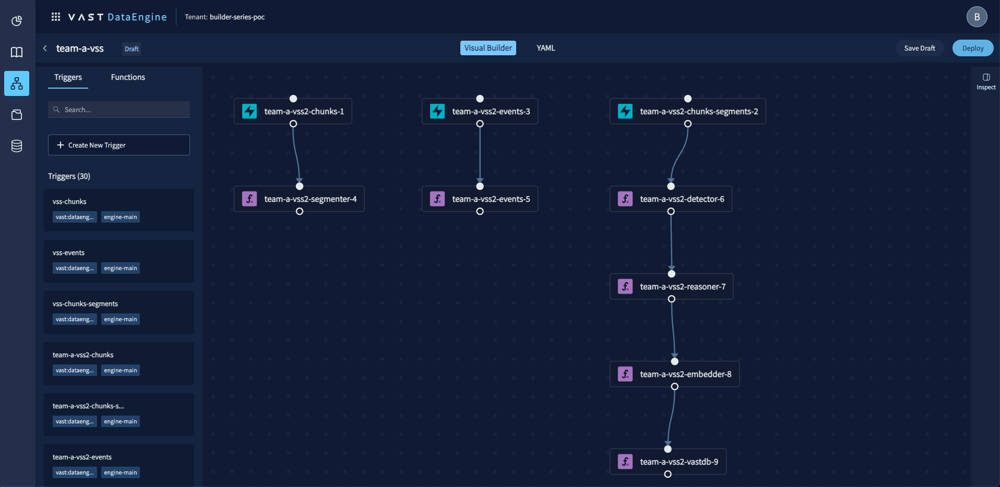
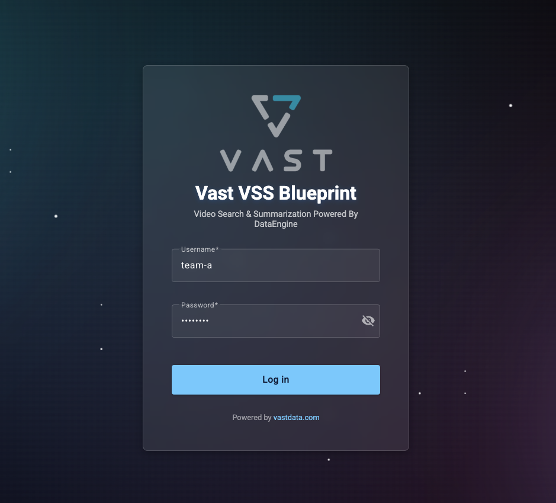
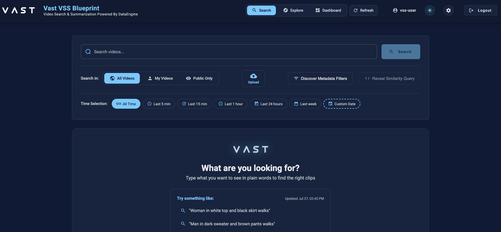
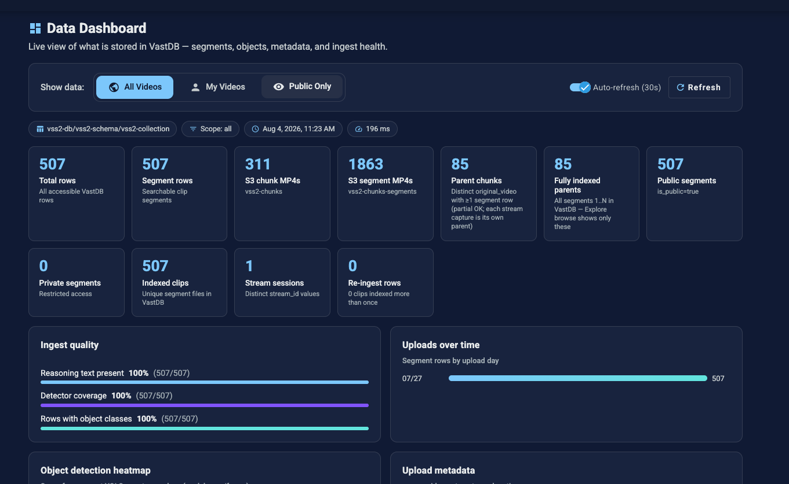

# VSS Hackathon Guidelines

Ten teams. Ten isolated **VAST Video Search System (VSS)** stacks. One shared idea: use video understanding + search + metadata to build something useful.

Each team gets its own pipeline, storage, UI, and credentials (`team-configs/<your-team>.config`). Your data stays in your namespace — you are not competing for someone else’s archive.

Each team gets a git repo with the **Cursor skills** for VSS.

- Attach your team’s config file to this repo at `team-configs/<your-team>.config` (organizers will give you this file).

---

## Add your Ingress URL to `/etc/hosts`

Your UI hostname (`INGRESS_URL` in `team-configs/<your-team>.config`) is not public DNS — map it on your laptop first.

```bash
sudo vim /etc/hosts
```

Add a line (replace the IP if your organizers gave you a different one, and use **your** team name):

```bash
# VSS hackathon — team UI
10.146.15.121  video-lab-<your-team>.cosmos.vastdata.com
```

Then open `http://video-lab-<your-team>.cosmos.vastdata.com` (same host as `INGRESS_URL` in your config).

---

## Models (NVIDIA on CoreWeave)

Inference for the pipeline runs on **NVIDIA** models hosted on **CoreWeave**:


| Model                                                  | Role in VSS                                            |
| ------------------------------------------------------ | ------------------------------------------------------ |
| **NVIDIA Cosmos Reason2** (`nvidia/cosmos-reason2-8b`) | Video understanding / reasoning over segments          |
| **NVIDIA Cosmos Embed1** (`nvidia/cosmos-embed1`)      | Text and visual embeddings (256-dim) for hybrid search |
| **YOLO11** (`yolo11s`)                                 | Object detection (bounding boxes / labels)             |


All teams share these CoreWeave-backed endpoints. You don’t deploy the models yourself — ingest and search call them through your pipeline and backend.

---

## Data Engine

### VSS Blueprint

DataEngine url UI:
https://10.146.15.201/#/login/builder-series-poc

Your team’s ingest runs as a **VAST DataEngine** serverless pipeline. A video chunk lands in S3, then functions run in sequence until searchable rows exist in VastDB.

```
S3 chunks (bucket)  →  Segmenter  →  S3 segments (bucket)
                                           ↓
                                        Detector → Reasoner → Embedder → VastDB writer
```

A separate **events / prompt-suggester** function runs on a schedule and feeds UI suggestions.



**VAST DataEngine (pipeline’s tab)** — there you can edit the pipeline and see the pipeline’s flow, logs, traces, etc.


| Function                      | What it does                                                                                       |
| ----------------------------- | -------------------------------------------------------------------------------------------------- |
| **Segmenter**                 | Splits each uploaded chunk into short fixed-length clips and writes them to the segments bucket.   |
| **Detector**                  | Runs **YOLO11** on each segment and records object classes, counts, and bbox sidecars.             |
| **Reasoner**                  | Calls **NVIDIA Cosmos Reason2** to write a searchable natural-language description of the segment. |
| **Embedder**                  | Calls **NVIDIA Cosmos Embed1** to build text (and visual) vectors for hybrid search.               |
| **VastDB writer**             | Persists embeddings, reasoning, detections, and metadata as a row in your VastDB collection.       |
| **Events (prompt-suggester)** | Periodically scans recent segments and writes suggested search prompts / key events for the UI.    |


You don’t need to redeploy this graph for the hackathon — treat it as the engine behind search, dashboard, and suggestions.

---

## What you were given

For your team you already have:


| Piece                   | What it is                                                                                                             |
| ----------------------- | ---------------------------------------------------------------------------------------------------------------------- |
| **Ingest pipeline**     | DataEngine functions that turn video chunks into searchable moments (segment → detect → reason → embed → write VastDB) |
| **UI**                  | Web app at your `INGRESS_URL` (frontend + backend)                                                                     |
| **S3 buckets**          | Chunks + segments for uploads                                                                                          |
| **VastDB**              | Indexed segments, embeddings, detections, reasoning text                                                               |
| **This repo in Cursor** | Agent skills that know how to call every important API                                                                 |


Open the UI, log in with your team user, and also open this project in **Cursor**. The skills are how you move fast.

---

## VSS UI

1. Go to your **Ingress URL** (`INGRESS_URL` in your team config).
2. **Log in** with your team’s username and password (`USERNAME` / `PASSWORD` in `team-configs/<your-team>.config`).



*Log in with your team’s username.*

3. Use the **Search** tab to query the archive.



*The Search tab.*

4. Open the **Dashboard** tab to inspect ingest health, object counts, and pipeline alignment.



*The VSS dashboard.*

Screenshots live in `docs/hackathon/`.

---

## The challenge

**Discover. Explore. Invent. Build.**

1. **Discover the skills** — ask Cursor what VSS can do; let it find and use the skills under `.cursor/skills/`.
2. **Explore the product** — search, filter by metadata, try suggestions, open the dashboard, explore clips, ask the agent.
3. **Imagine a use case** — security ops, warehouse safety, sports analysis, retail floors, traffic, training footage, media archive… anything video + meaning fits.
4. **Build something** — a workflow, a mini-app, a Cursor-driven demo, a report pipeline, a filtered “ops board”, a Q&A bot for your scenario. Use the APIs and skills.

Judges care about **clarity of the use case**, **clever use of search + metadata + features**, and **something that actually runs** — not how many slides you write.

---

## Starter videos

There are two shared sample videos for each team’s pipeline:


|             | Title                                                   | URL                                                                                        |
| ----------- | ------------------------------------------------------- | ------------------------------------------------------------------------------------------ |
| **Video 1** | This Happens in Manhattan When Everyone Goes Outside    | [https://www.youtube.com/watch?v=c6mxqc4HYOk](https://www.youtube.com/watch?v=c6mxqc4HYOk) |
| **Video 2** | 4K Road traffic video for object detection and tracking | [https://www.youtube.com/watch?v=MNn9qKG2UFI](https://www.youtube.com/watch?v=MNn9qKG2UFI) |


Use these to explore search, metadata, suggestions, dashboard, and agent Q&A out of the box.

You are **not limited** to these three. Ingest **any additional video** you need (upload chunks or stream capture) to support the app or service you build for your use case. Attach clear metadata so filters and demos stay sharp.

---

## You can do everything from Cursor (skills)

You do **not** need to memorize REST paths. In Cursor, describe what you want; the agent should pick the matching skill.

Useful skills (start here):


| Skill                       | Use it for                                                |
| --------------------------- | --------------------------------------------------------- |
| `retrieval/login`           | Get a JWT with your team username/password                |
| `retrieval/list-metadata`   | Discover filterable fields and legal values               |
| `retrieval/search`          | Semantic / hybrid search + optional LLM synthesis         |
| `retrieval/suggest-prompts` | AI-generated search chips & key events                    |
| `retrieval/dashboard`       | Counts, quality, objects, ingest vs index health          |
| `retrieval/agent-qa`        | Natural-language Q&A grounded in the archive              |
| `ingest/upload-videos`      | Put fixed-length (~30s) chunks into your S3 chunks bucket |
| `ingest/stream-capture`     | Start/stop live/URL capture via the API                   |


And a lot more :)  
Ask Cursor to discover the skills. He’s your best friend 🙂

Full skill index: `[.cursor/README.md](.cursor/README.md)`

---

## Suggested playbook

Write full prompts in Cursor: name what you want, point at your team config, and say what to build. A solid loop is **ingest → confirm indexing → ship a thin app on search / videos / dashboard**.

### Example prompts (adapt to your use case)

**1. Ingest and verify indexing**

> Ingest this video into my team environment:  
> [https://www.youtube.com/watch?v=c6mxqc4HYOk](https://www.youtube.com/watch?v=c6mxqc4HYOk)  
> Credentials are in `team-configs/<my-team>.config`.  
> Wait until the video is fully indexed, then run basic sanity checks on counts and pipeline health before we continue.  
> *(Cursor will use skills: `ingest/stream-capture`, `retrieval/dashboard`, `retrieval/login`)*

**2. Event alerts with before / moment / after clips**

> Build a small webpage that surfaces every **key event** in my use case (for example a goal, a forklift near a loading dock, or a person in a restricted zone).  
> For each hit, show a triptych: one clip **before**, the **event**, and one clip **after** (about 5 seconds each).  
> Serve it with a local proxy so browser CORS is handled, verify it end-to-end, and save it under `tools/`.  
> *(Cursor will use skills: `retrieval/login`, `retrieval/search`, `retrieval/videos`)*

**3. Object histogram with detection thumbnails**

> Build a standalone page with a histogram of the **top detected objects** in our archive.  
> For each object, show a small bounding-box crop from a real segment, embedded so the page works offline.  
> Save under `tools/`, open the page, and report the top five objects.  
> *(Cursor will use skills: `retrieval/login`, `retrieval/dashboard`, `retrieval/search`, `retrieval/videos`)*

### Your turn

1. Open your `INGRESS_URL` and log in with the team user from your config file.
2. Start from the starter videos (Video 1 / Video 2 / Video 3) and/or ingest your own content with clear metadata.
3. Ask Cursor to discover skills, then write prompts in this style for **your** scenario.
4. Ship something that runs: search + metadata (or detections / dashboard / agent) in a small vertical — not slides.

---

## Rules of the road

- Stay in **your** team credentials, buckets, and UI. Don’t poke other teams’ namespaces.
- Prefer **Cursor + skills** over hand-copying curl forever — but reading a skill once to understand the API is encouraged.
- Don’t burn the whole hackathon redeploying infrastructure; the stack is already up.
- If search returns nothing: check login, check dashboard/pipeline alignment, then check that metadata filter values actually exist (`retrieval/list-metadata`).
- Have fun — the win is a crisp story: *problem → video archive → search/filters → insight or action*.

---

## One-line summary

You have a private VSS: ingest video → understand it → search it with language and metadata → explain it with an agent and a dashboard. **Use Cursor to discover the skills, then invent a use case and make it real.**